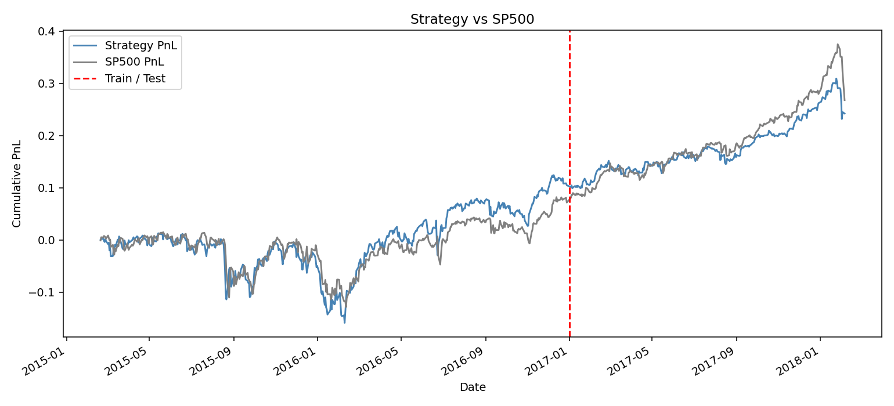

# Strategy report

## Features
Bollinger, RSI(14), MACD — **`ta`**.
Target on day D: `sign(return(D+1, D+2))`.

## Pipeline (sklearn)
- Imputer / Scaler / LogisticRegression via `make_pipeline` + `GridSearchCV`

## Cross-validation
Expanding Time Series Split, 10 folds (`TimeSeriesSplit` date-level + `GridSearchCV`).

Fold lengths:
- fold 1: train 510 days (2013-02-08 → 2015-02-18), validation 47 days (2015-02-19 → 2015-04-27)
- fold 2: train 557 days (2013-02-08 → 2015-04-27), validation 47 days (2015-04-28 → 2015-07-02)
- fold 3: train 604 days (2013-02-08 → 2015-07-02), validation 47 days (2015-07-06 → 2015-09-09)
- fold 4: train 651 days (2013-02-08 → 2015-09-09), validation 47 days (2015-09-10 → 2015-11-13)
- fold 5: train 698 days (2013-02-08 → 2015-11-13), validation 47 days (2015-11-16 → 2016-01-25)
- fold 6: train 745 days (2013-02-08 → 2016-01-25), validation 47 days (2016-01-26 → 2016-04-01)
- fold 7: train 792 days (2013-02-08 → 2016-04-01), validation 47 days (2016-04-04 → 2016-06-08)
- fold 8: train 839 days (2013-02-08 → 2016-06-08), validation 47 days (2016-06-09 → 2016-08-15)
- fold 9: train 886 days (2013-02-08 → 2016-08-15), validation 47 days (2016-08-16 → 2016-10-20)
- fold 10: train 933 days (2013-02-08 → 2016-10-20), validation 47 days (2016-10-21 → 2016-12-28)

## Strategy
Long-only (`ml_signal > 0.5`), $1/day. PnL = weight × fwd_return.
Drawdown: **`empyrical.max_drawdown`**.

## Metrics

| set | PnL | Max drawdown |
|-----|-----|--------------|
| train | 0.1046 | -0.1681 |
| test | 0.1376 | -0.0755 |
